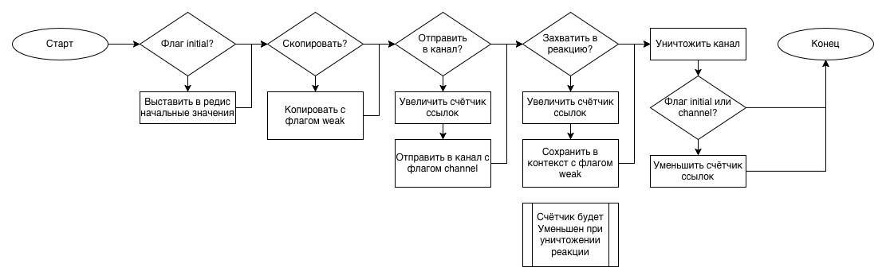
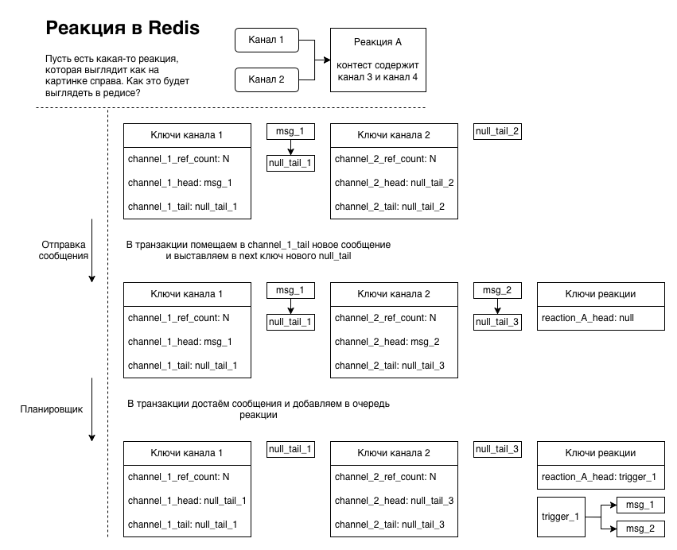
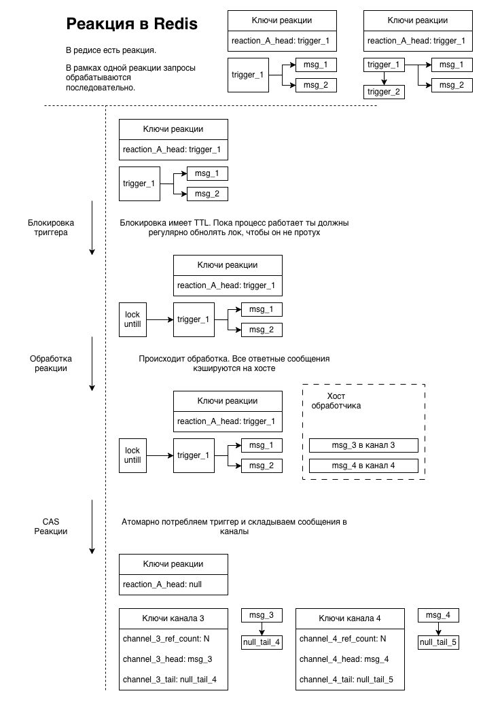

# Как выполнять программу распределённо без использования централизованной мастер ноды?

Использование ноды не подходит нам по 3 причинам
- Посколько мастер нода единственная она будет являться бутылочным горлышком системы и увеличение кол-ва нод с какого-то момента перестанет увеличивать производительность системы. Ограничения могут быть не только по сети и процессору, но и по памяти, ведь в реакции могут захватывать переменные.
- Сообщения не могу быть локальными, поэтому каждое из них будет как минимум 2 раза идти по сети между нодами.
- Нужно придумать что-то новое, чтобы защитить дипломную работу...

Для этого надо придумать как запускать задачи на разных нодах, так, чтобы отправка и потребление сообщений не требовали глобальной блокировки. Предлагается для этого закреплять каналы за конкретными нодами. Ниже расписаны методы, которые могут быть использоваты для этого. Кроме этого программе нужен ввод и вывод. Думаю что на этапе MVP ввод и вывод может выполняться с помощью каналов, которые передаются main функции.

### Consistent hashing

Каналы и реакции прикрепляются к нодам по остатку хэша от ID. Соотвественно, из местоположение будет статическим и не могут быть изменены, даже если одна из нод явзяется перегруженной, кроме того вероятность того, что сообщение будет проходить по сети 2 раза приближается к 1 с ростом числа нод.

Нужен discovery сервер.

### Redis

В некотором смысле это тот же мастер, но redis умеет масштабировать и является очень надёжным и быстрым (in memory). Из плюсов можно запускать скрипты прям в редисе, это очень быстро.

Его необязательно использовать как непосредственно транспорт, а скорее как истоник правды и тот же discorevy сервер, а данные слать напрямую между нодами. Кроме того через redis можно дать приложению доступ к разделяемоей памяти (например для больших объектов, которые по чуть-чуть читаются множеством потоков).

### Kafka

Очень масштабируемая и отказастойчивая, но при этом очень медленная из-за записи на диск всех сообщение. Вообще отказоустойчивость - это отдельный вопрос, если нам итересно проводить какие-то симуляции и вычисления и мы позиционируем наш язык именно для этого, то возможно её отсутствие будет не минусом, а плюсом, потому что создавать те же точки восстановления - это не бесплатно.

### Архитектура

По причинам озвученным выше предлагаю использовать Redis вместе с Consistent hashing для получения оптимального уровня производительности.

Каждый канал имеет уникальный ID, который генерируется на этапе его создания. Данные канала хранятся по этому ID с некоторым префиксом (например `channel_`). Для каждого канала известно кол-во ссылок на канал. Счётчик ссылок обновляться следующим образом:

- Счётчик ссылок
  - При инициализации счётчика его значение всегда 1
  - Увеличение значения возможно в 2 случаях: отправка канала в канал или захват канала в контекст реакции. По сути можно в конструкторе копирования добавить автоматическое увеличение счётчика, но создаение других shared_ptr'ов на объект в фукнции или копирование при вызове функции может не вызывать инкремент. Можем догововриться, что при создании alias'а канала или при передаче его в функцию мы будем использовать ссылку
  - При прочтении из канала конструктор НЕ должен увеличивать счётчик
  - При запуске реакции конструктор НЕ должен увеличивать, а деструктор уменьшать счётчик
  - При удалении реакции для захваченных каналов должен быть уменьшен счётчик
  - После уменьшения значения до 0 ключи eventually нужно очистить

Сообщения хранятся как связанный список из сообщений. Добавление и удаление сообщений происходит атомарно через redis скрипты. Планировщик не достаёт данные из редиса, он отцепляет их из связного списка и добавляет из в очередь конкретного исполнителя, берёт лок на исполнение и подтверждает его только после успешного выполненния. (Подробнее можно почитать в ADR _(тут будет ссылка)_)

