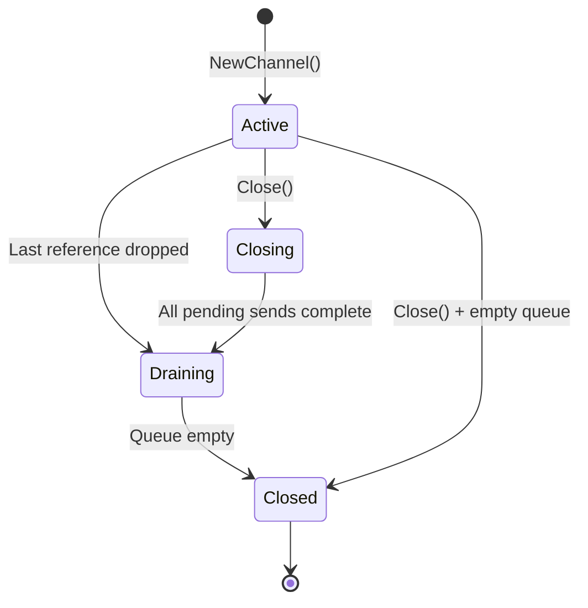
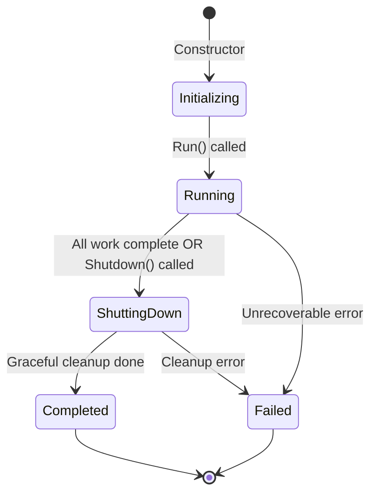
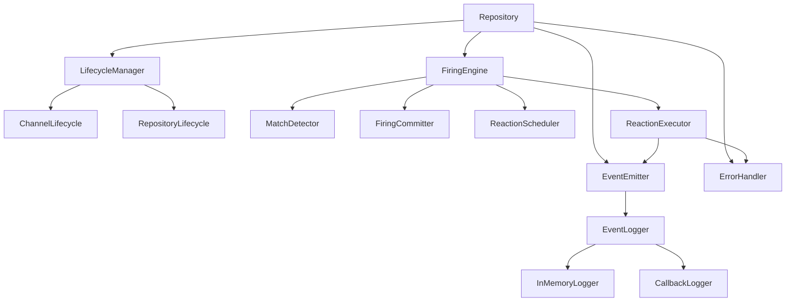
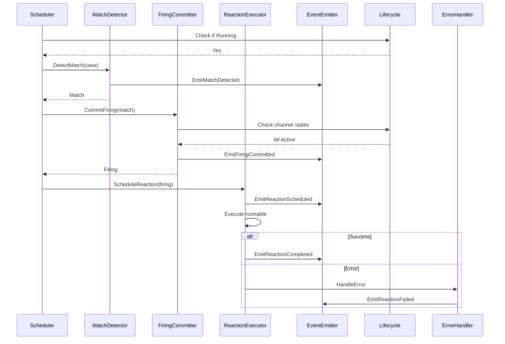

# Runtime Enhancement Architecture Plan

## Executive Summary

This document outlines the architectural design for three major enhancements to the GoJo parallel compute language runtime:

1. **Lifecycle Model** - Formalize channel and runtime lifecycle with explicit states
2. **Explicit Firing Model** - Extract firing logic into dedicated entities (Match, Firing, ScheduledReaction, ExecutionResult)
3. **Status, Error, and Tracing System** - Add comprehensive observability and error handling

## Current Architecture Analysis

### Existing Components

#### Core Abstractions
- **ChannelBase** ([`interface.hpp:15-35`](runtime/reactor/common/interface.hpp:15)) - Base class for channels with mode and type
- **Repository** ([`interface.hpp:47-55`](runtime/reactor/common/interface.hpp:47)) - Abstract interface for runtime implementations
- **Runnable** ([`interface.hpp:39-45`](runtime/reactor/common/interface.hpp:39)) - Executable reaction interface
- **CycleRepository** ([`parallel/repository.hpp:71-101`](runtime/reactor/parallel/repository.hpp:71)) - Parallel runtime implementation

#### Current Lifecycle (Informal)
- Channels live as long as `shared_ptr` references exist
- Work completes when queue is empty and no active threads
- Cleanup happens via `CheckQueueAliveById()` using reference counting
- No explicit state machine or termination protocol

#### Current Firing Logic (Scattered)
The firing process is embedded in [`CycleRepository::CheckCase()`](runtime/reactor/parallel/repository.cpp:188):
1. Check if all input channels are ready (have messages)
2. Check if any input channel is dead
3. If ready and alive, pop messages and schedule call
4. No explicit representation of match/firing/execution phases

#### Current Error Handling (Minimal)
- Debug assertions via [`runtime_assert()`](runtime/reactor/common/logging.hpp:12)
- No exception handling in reaction execution
- No error propagation or recovery mechanisms
- No structured logging beyond debug prints

### Identified Gaps

1. **Lifecycle Gaps**
   - No explicit channel states (Active, Closing, Closed, Draining)
   - No repository lifecycle states (Initializing, Running, ShuttingDown, Completed, Failed)
   - No graceful shutdown protocol
   - Channel cleanup is implicit via reference counting
   - No way to signal "no more messages will be sent"

2. **Firing Model Gaps**
   - Match detection mixed with execution scheduling
   - No representation of atomic message commitment
   - No audit trail of what fired and why
   - Difficult to debug join-case matching
   - No support for distributed transaction semantics

3. **Observability Gaps**
   - No structured event logging
   - No error capture or reporting
   - No performance metrics
   - No way to trace message flow
   - No debugging support for deadlocks or starvation

---

## 1. Lifecycle Model Design

### Channel Lifecycle States



#### State Definitions

**Active**
- Channel accepts new messages via `Push()`
- Messages can be consumed by join-cases
- Reference count > 1 OR queue not empty

**Closing**
- `Close()` has been called explicitly
- No new messages accepted (Push throws/returns error)
- Existing messages still consumable
- Transitions to Draining when all pending operations complete

**Draining**
- Last external reference dropped (use_count == 1)
- No new messages accepted
- Existing messages still consumable
- Transitions to Closed when queue becomes empty

**Closed**
- No messages in queue
- No external references
- Join-cases with this channel as input are removed
- Channel can be garbage collected

### Repository Lifecycle States



#### State Definitions

**Initializing**
- Repository created but not started
- Channels can be created
- Join-cases can be registered
- No execution happening

**Running**
- Main execution loop active
- Worker threads processing reactions
- Scheduler checking for matches
- Normal operation mode

**ShuttingDown**
- Triggered when: all channels closed + no pending work, OR explicit `Shutdown()` call
- No new join-cases accepted
- Existing reactions complete
- Graceful cleanup in progress

**Completed**
- All work finished successfully
- All channels closed
- All threads joined
- Clean exit

**Failed**
- Unrecoverable error occurred
- Error state captured
- Resources cleaned up (best effort)
- Error available for inspection

### Implementation Components

#### New Files

**`runtime/reactor/common/lifecycle.hpp`**
```cpp
namespace reactor {

enum class ChannelState {
    Active,
    Closing,
    Draining,
    Closed
};

enum class RepositoryState {
    Initializing,
    Running,
    ShuttingDown,
    Completed,
    Failed
};

class ChannelLifecycle {
public:
    ChannelLifecycle();
    
    ChannelState GetState() const noexcept;
    bool CanAcceptMessages() const noexcept;
    bool CanConsumeMessages() const noexcept;
    
    // State transitions
    void Close() noexcept;
    void OnLastReferenceDropped() noexcept;
    void OnQueueEmpty() noexcept;
    
    // Queries
    bool IsActive() const noexcept;
    bool IsClosed() const noexcept;
    
private:
    std::atomic<ChannelState> state_;
    mutable std::mutex mutex_;
};

class RepositoryLifecycle {
public:
    RepositoryLifecycle();
    
    RepositoryState GetState() const noexcept;
    
    // State transitions
    void Start() noexcept;
    void BeginShutdown() noexcept;
    void MarkCompleted() noexcept;
    void MarkFailed(std::string reason) noexcept;
    
    // Queries
    bool IsRunning() const noexcept;
    bool ShouldTerminate() const noexcept;
    Maybe<std::string> GetFailureReason() const noexcept;
    
private:
    std::atomic<RepositoryState> state_;
    Maybe<std::string> failure_reason_;
    mutable std::mutex mutex_;
};

std::string ToString(ChannelState state);
std::string ToString(RepositoryState state);

}  // namespace reactor
```

**`runtime/reactor/common/lifecycle.cpp`**
- Implementation of state machines
- Thread-safe state transitions
- State validation logic

#### Modified Files

**`runtime/reactor/common/interface.hpp`**
- Add `ChannelLifecycle` member to `ChannelBase`
- Add `Close()` method to `ChannelBase`
- Add `GetState()` method to `ChannelBase`

**`runtime/reactor/parallel/repository.hpp`**
- Add `RepositoryLifecycle` member to `CycleRepository`
- Add `Shutdown()` method
- Add `GetState()` method
- Add `WaitForCompletion()` method

**`runtime/reactor/parallel/repository.cpp`**
- Update `CheckQueueAliveById()` to use lifecycle state
- Update `CheckCase()` to respect channel states
- Update `Run()` to manage repository lifecycle
- Add graceful shutdown logic in main loop

---

## 2. Explicit Firing Model Design

### Firing Pipeline


### Entity Definitions

#### Match
Represents a detected opportunity to fire a join-case.

```cpp
struct Match {
    uint64_t match_id;              // Unique match identifier
    uint64_t join_case_id;          // Which join-case matched
    IDs input_channel_ids;          // Channel IDs involved
    std::chrono::steady_clock::time_point detected_at;
    
    std::string ToString() const;
};
```

**Purpose**: Captures the moment when all required messages are available for a join-case.

#### Firing
Represents the atomic commitment of messages for execution.

```cpp
struct Firing {
    uint64_t firing_id;             // Unique firing identifier
    Match match;                    // The match that triggered this
    Objects consumed_messages;      // Messages atomically removed from queues
    Objects context;                // Context objects for the reaction
    uint64_t runnable_id;           // Which reaction to execute
    std::chrono::steady_clock::time_point fired_at;
    
    std::string ToString() const;
};
```

**Purpose**: Represents the atomic transaction where messages are committed to a reaction. This is the point of no return - messages are removed from queues.

#### ScheduledReaction
Represents a reaction ready for execution.

```cpp
struct ScheduledReaction {
    uint64_t reaction_id;           // Unique reaction identifier
    Firing firing;                  // The firing that created this
    Runnable* runnable;             // The code to execute
    std::chrono::steady_clock::time_point scheduled_at;
    
    std::string ToString() const;
};
```

**Purpose**: Bridges the gap between firing (scheduler) and execution (worker threads). Contains all information needed to execute the reaction.

#### ExecutionResult
Represents the outcome of executing a reaction.

```cpp
enum class ExecutionStatus {
    Success,
    Failed,
    Cancelled
};

struct ExecutionResult {
    uint64_t reaction_id;           // Links back to ScheduledReaction
    ExecutionStatus status;
    Maybe<std::string> error_message;
    Maybe<std::exception_ptr> exception;
    std::chrono::steady_clock::time_point started_at;
    std::chrono::steady_clock::time_point completed_at;
    std::chrono::milliseconds duration;
    
    bool IsSuccess() const noexcept;
    bool IsFailed() const noexcept;
    std::string ToString() const;
};
```

**Purpose**: Captures the complete outcome of a reaction execution, including timing, success/failure, and error details.

### Implementation Components

#### New Files

**`runtime/reactor/common/firing.hpp`**
```cpp
namespace reactor {

// Forward declarations
struct Match;
struct Firing;
struct ScheduledReaction;
struct ExecutionResult;

// ID generators
class IDGenerator {
public:
    static IDGenerator& Instance();
    uint64_t NextMatchID();
    uint64_t NextFiringID();
    uint64_t NextReactionID();
    
private:
    std::atomic<uint64_t> match_counter_{0};
    std::atomic<uint64_t> firing_counter_{0};
    std::atomic<uint64_t> reaction_counter_{0};
};

// Match entity
struct Match {
    uint64_t match_id;
    uint64_t join_case_id;
    IDs input_channel_ids;
    std::chrono::steady_clock::time_point detected_at;
    
    std::string ToString() const;
};

// Firing entity
struct Firing {
    uint64_t firing_id;
    Match match;
    Objects consumed_messages;
    Objects context;
    uint64_t runnable_id;
    std::chrono::steady_clock::time_point fired_at;
    
    std::string ToString() const;
};

// ScheduledReaction entity
struct ScheduledReaction {
    uint64_t reaction_id;
    Firing firing;
    Runnable* runnable;
    std::chrono::steady_clock::time_point scheduled_at;
    
    std::string ToString() const;
};

// ExecutionResult entity
enum class ExecutionStatus {
    Success,
    Failed,
    Cancelled
};

struct ExecutionResult {
    uint64_t reaction_id;
    ExecutionStatus status;
    Maybe<std::string> error_message;
    Maybe<std::exception_ptr> exception;
    std::chrono::steady_clock::time_point started_at;
    std::chrono::steady_clock::time_point completed_at;
    std::chrono::milliseconds duration;
    
    bool IsSuccess() const noexcept;
    bool IsFailed() const noexcept;
    std::string ToString() const;
};

std::string ToString(ExecutionStatus status);

}  // namespace reactor
```

**`runtime/reactor/common/firing.cpp`**
- Implementation of all firing model entities
- ToString() methods for debugging
- ID generation logic

#### Modified Files

**`runtime/reactor/parallel/repository.hpp`**
- Add `DetectMatch()` method returning `Maybe<Match>`
- Add `CommitFiring()` method taking `Match` and returning `Firing`
- Add `ScheduleReaction()` method taking `Firing` and returning `ScheduledReaction`
- Add `ExecuteReaction()` method taking `ScheduledReaction` and returning `ExecutionResult`
- Store history of recent firings and results (for debugging/tracing)

**`runtime/reactor/parallel/repository.cpp`**
- Refactor `CheckCase()` into separate phases:
  1. `DetectMatch()` - check if case can fire
  2. `CommitFiring()` - atomically consume messages
  3. `ScheduleReaction()` - prepare for execution
- Update `RunRoutine()` to call `ExecuteReaction()` and handle results
- Add error handling with try-catch around reaction execution

---

## 3. Status, Error, and Tracing System Design

### Event Types

```cpp
enum class RuntimeEventType {
    // Channel events
    ChannelCreated,
    ChannelClosed,
    MessageSent,
    MessageReceived,
    
    // Matching events
    JoinCaseRegistered,
    JoinCaseRemoved,
    MatchDetected,
    MatchFailed,
    
    // Firing events
    FiringCommitted,
    FiringRolledBack,
    
    // Execution events
    ReactionScheduled,
    ReactionStarted,
    ReactionCompleted,
    ReactionFailed,
    
    // Lifecycle events
    RepositoryStarted,
    RepositoryShuttingDown,
    RepositoryCompleted,
    RepositoryFailed
};
```

### Event Structure

```cpp
struct RuntimeEvent {
    uint64_t event_id;
    RuntimeEventType type;
    std::chrono::steady_clock::time_point timestamp;
    std::thread::id thread_id;
    
    // Event-specific data (variant or polymorphic)
    std::variant<
        ChannelEventData,
        MatchEventData,
        FiringEventData,
        ReactionEventData,
        LifecycleEventData
    > data;
    
    std::string ToString() const;
    std::string ToJSON() const;
};
```

### Event Data Structures

```cpp
struct ChannelEventData {
    uint64_t channel_id;
    ChannelMode mode;
    Type payload_type;
    Maybe<Object> message;  // For MessageSent/Received
};

struct MatchEventData {
    uint64_t match_id;
    uint64_t join_case_id;
    IDs channel_ids;
    bool success;
    Maybe<std::string> failure_reason;
};

struct FiringEventData {
    uint64_t firing_id;
    uint64_t match_id;
    size_t message_count;
};

struct ReactionEventData {
    uint64_t reaction_id;
    uint64_t firing_id;
    Maybe<ExecutionResult> result;
};

struct LifecycleEventData {
    RepositoryState state;
    Maybe<std::string> reason;
};
```

### Tracing Infrastructure

#### Event Logger

```cpp
class EventLogger {
public:
    virtual ~EventLogger() noexcept = default;
    virtual void Log(const RuntimeEvent& event) = 0;
    virtual void Flush() = 0;
};

class InMemoryEventLogger : public EventLogger {
public:
    explicit InMemoryEventLogger(size_t max_events = 10000);
    
    void Log(const RuntimeEvent& event) override;
    void Flush() override;
    
    std::vector<RuntimeEvent> GetEvents() const;
    std::vector<RuntimeEvent> GetEventsByType(RuntimeEventType type) const;
    std::vector<RuntimeEvent> GetEventsInRange(
        std::chrono::steady_clock::time_point start,
        std::chrono::steady_clock::time_point end) const;
    
    void Clear();
    size_t Size() const;
    
private:
    mutable std::mutex mutex_;
    std::deque<RuntimeEvent> events_;
    size_t max_events_;
};

class CallbackEventLogger : public EventLogger {
public:
    using Callback = std::function<void(const RuntimeEvent&)>;
    
    explicit CallbackEventLogger(Callback callback);
    
    void Log(const RuntimeEvent& event) override;
    void Flush() override;
    
private:
    Callback callback_;
};

class CompositeEventLogger : public EventLogger {
public:
    void AddLogger(Pointer<EventLogger> logger);
    void Log(const RuntimeEvent& event) override;
    void Flush() override;
    
private:
    std::vector<Pointer<EventLogger>> loggers_;
    mutable std::mutex mutex_;
};
```

#### Event Emitter

```cpp
class EventEmitter {
public:
    explicit EventEmitter(Pointer<EventLogger> logger = nullptr);
    
    void SetLogger(Pointer<EventLogger> logger);
    Pointer<EventLogger> GetLogger() const;
    
    // Channel events
    void EmitChannelCreated(uint64_t channel_id, ChannelMode mode, const Type& type);
    void EmitChannelClosed(uint64_t channel_id);
    void EmitMessageSent(uint64_t channel_id, const Object& message);
    void EmitMessageReceived(uint64_t channel_id, const Object& message);
    
    // Match events
    void EmitJoinCaseRegistered(uint64_t join_case_id, const IDs& channel_ids);
    void EmitMatchDetected(const Match& match);
    void EmitMatchFailed(uint64_t join_case_id, const std::string& reason);
    
    // Firing events
    void EmitFiringCommitted(const Firing& firing);
    
    // Reaction events
    void EmitReactionScheduled(const ScheduledReaction& reaction);
    void EmitReactionStarted(uint64_t reaction_id);
    void EmitReactionCompleted(const ExecutionResult& result);
    void EmitReactionFailed(const ExecutionResult& result);
    
    // Lifecycle events
    void EmitRepositoryStarted();
    void EmitRepositoryShuttingDown();
    void EmitRepositoryCompleted();
    void EmitRepositoryFailed(const std::string& reason);
    
private:
    RuntimeEvent CreateEvent(RuntimeEventType type, auto data) const;
    
    Pointer<EventLogger> logger_;
    std::atomic<uint64_t> event_counter_{0};
    mutable std::mutex mutex_;
};
```

### Error Handling

#### Error Policy

```cpp
enum class ErrorPolicy {
    FailFast,           // Terminate runtime on first error
    IsolateReaction,    // Log error, continue with other reactions
    RetryOnce,          // Retry failed reaction once
    RetryWithBackoff    // Retry with exponential backoff
};

class ErrorHandler {
public:
    explicit ErrorHandler(ErrorPolicy policy = ErrorPolicy::IsolateReaction);
    
    void SetPolicy(ErrorPolicy policy);
    ErrorPolicy GetPolicy() const;
    
    // Handle execution error
    void HandleReactionError(
        const ScheduledReaction& reaction,
        const std::exception_ptr& exception);
    
    // Query error state
    bool HasErrors() const;
    std::vector<ExecutionResult> GetFailedReactions() const;
    void ClearErrors();
    
private:
    ErrorPolicy policy_;
    std::vector<ExecutionResult> failed_reactions_;
    mutable std::mutex mutex_;
};
```

### Implementation Components

#### New Files

**`runtime/reactor/common/events.hpp`**
- RuntimeEventType enum
- RuntimeEvent struct
- Event data structures
- Event serialization

**`runtime/reactor/common/events.cpp`**
- Event creation and formatting
- JSON serialization
- Event filtering utilities

**`runtime/reactor/common/event_logger.hpp`**
- EventLogger interface
- InMemoryEventLogger
- CallbackEventLogger
- CompositeEventLogger

**`runtime/reactor/common/event_logger.cpp`**
- Logger implementations
- Thread-safe event storage
- Event querying

**`runtime/reactor/common/event_emitter.hpp`**
- EventEmitter class
- Convenience methods for emitting events

**`runtime/reactor/common/event_emitter.cpp`**
- Event emission logic
- Event ID generation

**`runtime/reactor/common/error_handler.hpp`**
- ErrorPolicy enum
- ErrorHandler class

**`runtime/reactor/common/error_handler.cpp`**
- Error handling strategies
- Error storage and reporting

#### Modified Files

**`runtime/reactor/common/interface.hpp`**
- Add `EventEmitter` member to `Repository`
- Add `GetEventLogger()` method
- Add `GetErrorHandler()` method

**`runtime/reactor/parallel/repository.hpp`**
- Add `EventEmitter` member
- Add `ErrorHandler` member
- Add event emission calls throughout

**`runtime/reactor/parallel/repository.cpp`**
- Emit events at key points:
  - Channel creation/closure
  - Message send/receive
  - Match detection
  - Firing commitment
  - Reaction execution
  - Lifecycle transitions
- Wrap reaction execution in try-catch
- Handle errors according to policy

---

## Integration Architecture

### Component Relationships



### Execution Flow with All Systems



---

## File Structure

### New Files to Create

```
runtime/reactor/common/
├── lifecycle.hpp              # Channel and repository lifecycle
├── lifecycle.cpp
├── firing.hpp                 # Firing model entities
├── firing.cpp
├── events.hpp                 # Event types and structures
├── events.cpp
├── event_logger.hpp           # Event logging infrastructure
├── event_logger.cpp
├── event_emitter.hpp          # Event emission interface
├── event_emitter.cpp
├── error_handler.hpp          # Error handling policies
└── error_handler.cpp
```

### Files to Modify

```
runtime/reactor/common/
├── interface.hpp              # Add lifecycle, events, errors
├── interface.cpp              # Update implementations
└── helpers.hpp                # Add utility types

runtime/reactor/parallel/
├── repository.hpp             # Integrate all new systems
└── repository.cpp             # Refactor with new architecture

runtime/reactor/distributed/
├── repository.hpp             # Add same integrations
└── repository.cpp             # Adapt for distributed context
```

---

## Implementation Phases

### Phase 1: Lifecycle Model
1. Create lifecycle.hpp/cpp with state machines
2. Integrate ChannelLifecycle into ChannelBase
3. Integrate RepositoryLifecycle into CycleRepository
4. Update channel cleanup logic
5. Add graceful shutdown
6. Write unit tests

### Phase 2: Firing Model
1. Create firing.hpp/cpp with entities
2. Refactor CheckCase into separate phases
3. Add Match detection logic
4. Add Firing commitment logic
5. Add ScheduledReaction creation
6. Add ExecutionResult capture
7. Write unit tests

### Phase 3: Events and Tracing
1. Create events.hpp/cpp with event types
2. Create event_logger.hpp/cpp with loggers
3. Create event_emitter.hpp/cpp
4. Integrate EventEmitter into Repository
5. Add event emission throughout codebase
6. Write unit tests

### Phase 4: Error Handling
1. Create error_handler.hpp/cpp
2. Integrate ErrorHandler into Repository
3. Add try-catch around reaction execution
4. Implement error policies
5. Add error reporting
6. Write unit tests

### Phase 5: Integration and Testing
1. Integrate all systems in CycleRepository
2. Update distributed repository
3. Write integration tests
4. Write example programs demonstrating features
5. Performance testing
6. Documentation

---

## Testing Strategy

### Unit Tests

**Lifecycle Tests**
- State transitions (valid and invalid)
- Thread safety of state changes
- Channel closure scenarios
- Repository shutdown scenarios

**Firing Model Tests**
- Match detection accuracy
- Firing atomicity
- Reaction scheduling
- ExecutionResult capture

**Event System Tests**
- Event creation and formatting
- Logger implementations
- Event filtering and querying
- Thread safety

**Error Handling Tests**
- Each error policy behavior
- Error isolation
- Error reporting
- Recovery scenarios

### Integration Tests

**End-to-End Scenarios**
- Simple message passing with tracing
- Join-case matching with events
- Error in reaction with isolation
- Graceful shutdown
- Channel closure propagation

**Performance Tests**
- Event logging overhead
- Lifecycle state check overhead
- Firing model overhead
- Memory usage with event history

---

## API Examples

### Using Lifecycle

```cpp
// Create repository with lifecycle
auto repo = CycleRepository::GetRepository();

// Check state
if (repo.GetState() == RepositoryState::Running) {
    // Do work
}

// Graceful shutdown
repo.Shutdown();
repo.WaitForCompletion();

// Check for errors
if (repo.GetState() == RepositoryState::Failed) {
    auto reason = repo.GetLifecycle().GetFailureReason();
    std::cerr << "Failed: " << reason.value() << std::endl;
}
```

### Using Events

```cpp
// Create logger
auto logger = std::make_shared<InMemoryEventLogger>(10000);

// Create repository with logger
auto repo = CycleRepository::GetRepository();
repo.SetEventLogger(logger);

// Run program
repo.Run(main_id, runnables);

// Query events
auto events = logger->GetEvents();
for (const auto& event : events) {
    std::cout << event.ToString() << std::endl;
}

// Filter events
auto firing_events = logger->GetEventsByType(RuntimeEventType::FiringCommitted);
```

### Using Error Handling

```cpp
// Configure error policy
auto repo = CycleRepository::GetRepository();
repo.GetErrorHandler().SetPolicy(ErrorPolicy::IsolateReaction);

// Run program
repo.Run(main_id, runnables);

// Check for errors
if (repo.GetErrorHandler().HasErrors()) {
    auto failed = repo.GetErrorHandler().GetFailedReactions();
    for (const auto& result : failed) {
        std::cerr << "Reaction " << result.reaction_id 
                  << " failed: " << result.error_message.value() << std::endl;
    }
}
```

---

## Distributed Runtime Considerations

### Adaptations Needed

1. **Lifecycle**
   - Channel states must be synchronized across nodes
   - Repository state needs distributed consensus
   - Shutdown must coordinate across all nodes

2. **Firing Model**
   - Match detection may be distributed
   - Firing commitment needs distributed transaction
   - ExecutionResult must be serializable

3. **Events**
   - Events must be serializable (JSON support)
   - Event logger may be centralized or distributed
   - Event timestamps need clock synchronization

4. **Error Handling**
   - Errors may occur on remote nodes
   - Error propagation across network
   - Partial failure handling

### Design Decisions for Distributed

- All entities (Match, Firing, etc.) are serializable
- Event system uses JSON for network transport
- Lifecycle states use distributed consensus (future)
- Error handling supports remote error reporting

---

## Performance Considerations

### Overhead Analysis

**Lifecycle**
- State checks: atomic read (minimal overhead)
- State transitions: atomic write + mutex (rare operations)
- Expected impact: < 1% overhead

**Firing Model**
- Entity creation: small allocations
- ID generation: atomic increment
- Expected impact: < 2% overhead

**Events**
- Event creation: allocation + timestamp
- Logging: lock + append to buffer
- Expected impact: 5-10% with in-memory logger
- Mitigation: make logging optional, use ring buffer

**Error Handling**
- Try-catch: zero cost when no exception
- Error storage: only on failure
- Expected impact: < 1% in success case

### Optimization Strategies

1. **Event Batching**: Batch events before logging
2. **Lock-Free Logging**: Use lock-free queue for events
3. **Sampling**: Log only percentage of events
4. **Lazy Formatting**: Defer ToString() until needed
5. **Compile-Time Flags**: Disable tracing in release builds

---

## Documentation Requirements

### Code Documentation

- Doxygen comments for all public APIs
- State machine diagrams in header comments
- Usage examples in class documentation
- Thread safety guarantees documented

### User Documentation

- Architecture overview document
- API reference guide
- Tutorial: Using lifecycle model
- Tutorial: Debugging with events
- Tutorial: Error handling strategies
- Migration guide from old API

### Developer Documentation

- Implementation notes
- Design decisions (ADRs)
- Testing guide
- Performance tuning guide

---

## Success Criteria

### Functional Requirements

✅ Channel lifecycle with explicit states
✅ Repository lifecycle with graceful shutdown
✅ Explicit firing model with all entities
✅ Comprehensive event logging
✅ Configurable error handling
✅ Thread-safe implementations
✅ Backward compatible API (where possible)

### Non-Functional Requirements

✅ < 10% performance overhead with tracing enabled
✅ < 1% performance overhead with tracing disabled
✅ Thread-safe event logging
✅ Memory-bounded event storage
✅ Extensible event logger interface